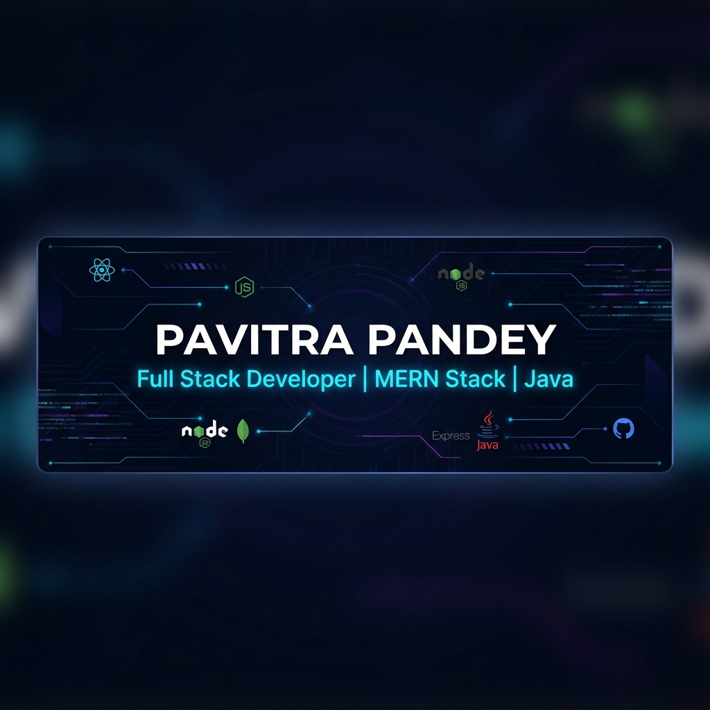

  
  
   

  

---

  <code>
    [ <a href="#-tech-stack">⚙️ TECH STACK</a> ] •
    [ <a href="#-mission-log">🚀 PROJECTS</a> ] •
    [ <a href="#-comm-link">📫 CONTACT</a> ]
  </code>

 

### 🚀 Engineering Scalable Solutions

I'm a **Full Stack Developer** focused on performance, architecture, and user-centric design. I don't just write code; I build systems that solve real-world problems.

- � **Current Focus:** Building **LifeCode**, a gamified habit tracker pushing the boundaries of user retention strategies.
- � **The Stack:**    
- 🤝 **Collaboration:** Open to discussions on System Design, Cloud Architecture, and optimizing MERN applications.

  
  
  

---

<h3 id="-tech-stack" align="center">⚡ Technologies & Tools</h3>

  

 

<h3 id="-mission-log">🚀 Selected Mission Logs (Projects)</h3>

| Project | Description | Stack | Status |
| :--- | :--- | :--- | :--- |
| **[LifeCode (Life Tracker)](https://github.com/2005pavitra/Life-Tracker)** | Gamified habit tracker with quests & tiered tasks | `MERN` `Tailwind` | 🟡 In Dev |
| **[Algo-Vault](https://github.com/2005pavitra/Algo-Vault)** | DSA Progress Tracker with LeetCode integration | `React` `Node` | 🟢 Live |
| **[Price Tracker](https://github.com/2005pavitra/Price-Tracker-Ecommerce)** | E-commerce price tracking & comparison tool | `Scraping` `React` | 🟢 Live |
| **[Email Blaster](https://github.com/2005pavitra/Email-Blaster)** | Bulk email sender with OAuth integration | `MERN` `Nodemailer` | 🟢 Live |

---

 

<h3 id="-comm-link" align="center">📫 Comm Link</h3>

  
  
  
  

 

  

