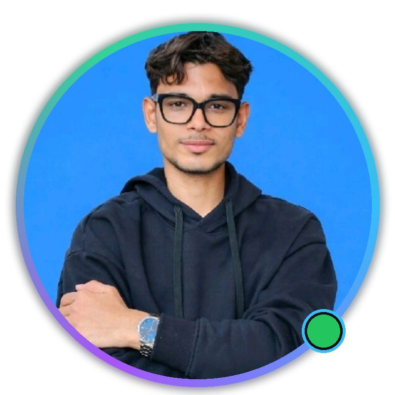

<div align="center">
  <!-- Dynamic Hero Banner -->
  

  <!-- Animated Typing Tagline (Engineering & Distributed Systems Focus) -->
  <a href="https://github.com/2005pavitra">
    
  </a>

  <br/><br/>

  <!-- Quick Navigation Pills -->
  <p align="center">
    <a href="#-about-me"></a>
    <a href="#-featured-systems"></a>
    <a href="#-tech-arsenal"></a>
    <a href="#-github-metrics"></a>
    <a href="#-get-in-touch"></a>
  </p>
</div>

---

<!-- Interactive Split Hero Card with Creative Profile Avatar -->
<table border="0" width="100%">
  <tr>
    <td width="72%" valign="middle">
      <h2>👋 Hey there, I'm <a href="https://linkedin.com/in/pavitra-pandey">Pavitra Pandey</a></h2>
      <p>
        I'm a <b>Full Stack & Distributed Systems Engineer</b> with a core focus on architecting <b>high-throughput event-driven microservices</b>, <b>resilient caching layers</b>, and <b>production-grade web platforms</b>.
      </p>
      <p>
        🎓 <b>B.Tech in Information Technology</b> @ <a href="https://uitrgpv.ac.in/">UIT-RGPV</a> (2023 - 2027)<br/>
        💼 <b>Technical Co-Head</b> @ <a href="https://ecellrgpv.com/">E-Cell UIT-RGPV</a><br/>
        🟢 <b>Status:</b> <code>Open to Software Engineering & Full Stack Roles</code>
      </p>
      <p>
        <a href="https://linkedin.com/in/pavitra-pandey"></a>
        <a href="https://resume-ai-eight-zeta.vercel.app"></a>
        <a href="https://algo-vault-two.vercel.app/"></a>
        <a href="mailto:pavitrapandeysagar@gmail.com"></a>
        <a href="https://x.com/PavitraPandey20"></a>
      </p>
    </td>
    <td width="28%" align="center" valign="middle">
      <a href="https://linkedin.com/in/pavitra-pandey">
        
      </a>
      <br/>
      <sub><b>Pavitra Pandey</b></sub>
    </td>
  </tr>
</table>

---

<h3 id="-about-me">👨‍💻 About Me</h3>

```yaml
name: Pavitra Pandey
role: Full Stack & Distributed Systems Engineer
education: B.Tech in Information Technology @ UIT-RGPV (2023 - 2027)
leadership: Technical Co-Head @ E-Cell, UIT-RGPV
core_interests: [ "Event-Driven Microservices", "High-Throughput Caching", "AI Systems", "System Design" ]
philosophy: "Architecting software that scales predictably, fails gracefully, and delivers measurable impact."
```

- 🚀 **Flagship Build:** [CareerSignal](https://resume-ai-eight-zeta.vercel.app) — Event-driven career fit intelligence & AI mock interview studio using Kafka, Redis, and Groq/Gemini.
- ⚡ **Productivity Engineering:** [Algo-Vault](https://algo-vault-two.vercel.app/) — Manifest V3 Chrome Extension + SM-2 spaced repetition algorithmic review engine.
- 🏆 **Hackathons:** Runner-Up at **MLSA DevSprint Hackathon 1.0** — designed and shipped full-stack production solutions under tight deadlines.
- 🤝 **Leadership:** Technical Co-Head at E-Cell UIT-RGPV, mentoring junior engineers in full-stack architecture, clean code, and production workflows.

---

<h3 id="-featured-systems">🚀 Featured Systems & Architectures</h3>

<!-- CareerSignal Showcase Card -->
#### 📡 [CareerSignal](https://resume-ai-eight-zeta.vercel.app) — Event-Driven Job Fit Intelligence & AI Mock Studio
> *Production-grade distributed system processing resumes, ATS compatibility scoring, and LLM mock interviews asynchronously.*

<p>
  <a href="https://resume-ai-eight-zeta.vercel.app"></a>
  &nbsp;
  <a href="https://github.com/2005pavitra/CareerSignal"></a>
  &nbsp;
  <a href="https://hub.docker.com/r/pavitrapandey/resume-ai-backend"></a>
</p>

<table border="0" width="100%">
  <tr>
    <td width="55%" valign="top">
      <b>⚡ Architecture & Engineering Highlights:</b>
      <ul>
        <li><b>Event-Driven Kafka Decoupling:</b> Offloaded heavy resume parsing, ATS scoring, and LLM prompt chaining to asynchronous background workers, cutting synchronous API response times by <b>65%</b>.</li>
        <li><b>Sub-40ms Redis Cache-Aside:</b> Built intelligent sliding-window caching for generated reports and implemented <i>O(1)</i> Redis JWT blacklist token revocation for secure, state-independent user logouts.</li>
        <li><b>Idempotent Deduplication Engine:</b> SHA-256 payload hashing and MongoDB unique compound indices eliminate <b>100% duplicate computations</b> on identical document submissions.</li>
        <li><b>Dual-LLM Scoring Engine:</b> Groq (LLaMA 3.3) for sub-second evaluations and Gemini fallback, scoring against Google's X-Y-Z formula for bullet quantification.</li>
      </ul>
      <p>
        
        
        
        
        
        
      </p>
    </td>
    <td width="45%" align="center" valign="middle">
      <a href="https://github.com/2005pavitra/CareerSignal">
        
      </a>
      <br/><br/>
      
      
      
    </td>
  </tr>
</table>

<br/>

<!-- Algo-Vault Showcase Card -->
#### ⚡ [Algo-Vault](https://algo-vault-two.vercel.app/) — Spaced Repetition Tracker & Chrome Extension
> *Developer workflow optimization tool featuring a background browser extension and SuperMemo SM-2 retention scheduler.*

<p>
  <a href="https://algo-vault-two.vercel.app/"></a>
  &nbsp;
  <a href="https://github.com/2005pavitra/Algo-Vault"></a>
  &nbsp;
  
</p>

<table border="0" width="100%">
  <tr>
    <td width="55%" valign="top">
      <b>⚡ Architecture & Engineering Highlights:</b>
      <ul>
        <li><b>Manifest V3 Background Interceptor:</b> Engineered a Chrome Extension that intercepts submission events on LeetCode/CodeChef, auto-capturing code, difficulty, runtime stats, and tags with <b>0 manual copying</b>.</li>
        <li><b>SuperMemo SM-2 Retention Engine:</b> Implemented spaced repetition interval algorithms (Again / Hard / Good / Easy) to beat the Ebbinghaus forgetting curve through adaptive review cycles.</li>
        <li><b>Visual Analytics Suite:</b> Dynamic activity heatmaps, problem difficulty categorization, and syntax-highlighted code playback engine.</li>
      </ul>
      <p>
        
        
        
        
        
        
      </p>
    </td>
    <td width="45%" align="center" valign="middle">
      <a href="https://github.com/2005pavitra/Algo-Vault">
        
      </a>
      <br/><br/>
      
      
      
    </td>
  </tr>
</table>

<br/>

<!-- Additional Projects Grid -->
<table border="0" width="100%">
  <tr>
    <td width="50%" valign="top">
      <h3 align="center">🎮 LifeCode (Life-Tracker)</h3>
      <p align="center">
        <b>Gamified Habit & Goal Tracking Architecture</b>
      </p>
      <p align="center">
        <a href="https://github.com/2005pavitra/Life-Tracker"></a>
      </p>
      <ul>
        <li>RPG-inspired habit tracker transforming real-world daily productivity into quest lines, XP progression, and level-ups.</li>
        <li>Interactive quest trees, streak protection algorithms, and customizable habit categories.</li>
        <li>Engineered with React, Node.js, Express, MongoDB, and Tailwind CSS.</li>
      </ul>
      <p align="center">
        <code>React</code> • <code>Node.js</code> • <code>Express</code> • <code>MongoDB</code> • <code>Tailwind</code>
      </p>
    </td>
    <td width="50%" valign="top">
      <h3 align="center">📊 Price-Tracker & Scraper</h3>
      <p align="center">
        <b>Automated E-Commerce Price Intelligence</b>
      </p>
      <p align="center">
        <a href="https://github.com/2005pavitra/Price-Tracker-Ecommerce"></a>
      </p>
      <ul>
        <li>Automated web scraping pipeline monitoring multi-vendor product price fluctuations and stock drops.</li>
        <li>Notification dispatch engine alerting users when historical lowest prices are triggered.</li>
        <li>Historical price graphing, threshold tracking, and trend analysis dashboard.</li>
      </ul>
      <p align="center">
        <code>Node.js</code> • <code>Cheerio / Puppeteer</code> • <code>Express</code> • <code>MongoDB</code>
      </p>
    </td>
  </tr>
</table>

---

<h3 id="-tech-arsenal">🛠️ Tech Arsenal</h3>

<div align="center">
  <table border="0">
    <tr>
      <td align="right"><b>Core Languages:</b></td>
      <td>
        
        
        
        
        
        
        
        
      </td>
    </tr>
    <tr>
      <td align="right"><b>Frontend & UI:</b></td>
      <td>
        
        
        
        
        
        
      </td>
    </tr>
    <tr>
      <td align="right"><b>Backend & Systems:</b></td>
      <td>
        
        
        
        
        
        
        
      </td>
    </tr>
    <tr>
      <td align="right"><b>Databases & Storage:</b></td>
      <td>
        
        
        
        
      </td>
    </tr>
    <tr>
      <td align="right"><b>DevOps & Cloud:</b></td>
      <td>
        
        
        
        
        
        
        
      </td>
    </tr>
    <tr>
      <td align="right"><b>AI & Specialized:</b></td>
      <td>
        
        
        
        
      </td>
    </tr>
  </table>
</div>

---

<h3 id="-github-metrics">📊 GitHub Activity & Open Source Metrics</h3>

<div align="center">
  <table border="0">
    <tr>
      <td align="center" width="50%">
        <a href="https://github.com/2005pavitra">
          
        </a>
      </td>
      <td align="center" width="50%">
        <a href="https://github.com/2005pavitra">
          
        </a>
      </td>
    </tr>
  </table>

  <br/>

  <a href="https://github.com/2005pavitra">
    
  </a>
</div>

---

<h3 id="-get-in-touch">📬 Get In Touch</h3>

<div align="center">
  <a href="https://www.linkedin.com/in/pavitra-pandey">
    
  </a>
  &nbsp;
  <a href="mailto:pavitrapandeysagar@gmail.com">
    
  </a>
  &nbsp;
  <a href="https://github.com/2005pavitra">
    
  </a>
  &nbsp;
  <a href="https://x.com/PavitraPandey20">
    
  </a>
</div>

<br/>

<div align="center">
  
</div>
